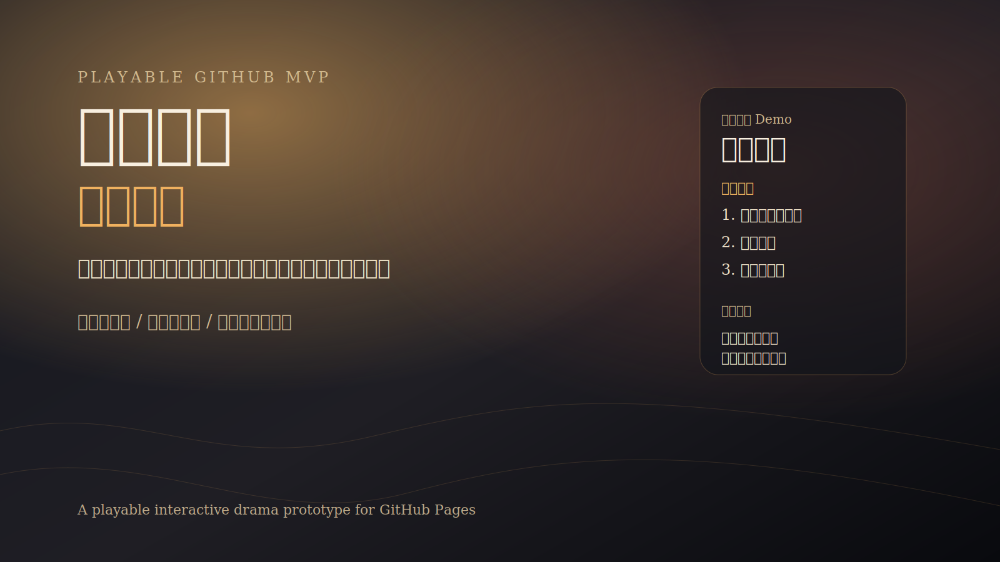

# 改命剧场

在那些你最不甘心的节点里，亲手改写结局。



这是一个互动叙事游戏 MVP。玩家从一个耳熟能详的关键节点切入，通过多重选择改写角色命运，并在结算页看到本轮的改命度、局势代价、角色生还与传播张力。

当前版本还支持：

1. 多剧本切换
2. 改命档案记录
3. 隐藏结局路线
4. 结局标签与“下一轮建议”

## 在线试玩

推送到 GitHub 并启用 Pages 后，公开试玩链接会是：

- `https://<your-github-username>.github.io/<repo-name>/`

当前仓库已经包含可直接发布的静态 Demo：

- [prototype/gaiming-juchang-mvp/index.html](/Users/wizout/op/openclaw/prototype/gaiming-juchang-mvp/index.html)

## 当前公开 Demo

- `麦城前夜`
- `鸿门宴前席`
- `风雪山神庙前夕`
- 当前验证指标：
  - 玩家是否愿意反复重开
  - 玩家是否会分享自己的结局
  - 评论区是否会围绕“活下来 vs 传奇”形成争论
  - 不同题材是否会激发不同类型的讨论
  - 隐藏结局是否能明显拉高二周目冲动

## 为什么先做这个

1. 历史题材更适合公开发布和传播
2. GitHub Pages 能最快给出可试玩链接
3. 这条路径能验证玩法，而不是先把时间花在复杂引擎和平台流程上

## 仓库结构

```text
/docs
  GAIMING_JUCHANG_MVP_PLAN.md
  GITHUB_LANDSCAPE_AND_COPYRIGHT_STRATEGY.md
/prototype/gaiming-juchang-mvp
  index.html
  styles.css
  app.js
  /assets
/.github/workflows
  pages.yml
/.github/ISSUE_TEMPLATE
  bug_report.md
  feature_request.md
  story_node_request.md
CHANGELOG.md
ROADMAP.md
COPYRIGHT_POLICY.md
ASSET_LICENSES.md
CONTRIBUTING.md
LICENSE
README.md
```

## 本地运行

直接打开：

- `prototype/gaiming-juchang-mvp/index.html`

或者运行：

```bash
cd prototype/gaiming-juchang-mvp
python3 -m http.server 8080
```

访问：

- `http://127.0.0.1:8080`

## 发布到 GitHub Pages

工作流见：

- [.github/workflows/pages.yml](/Users/wizout/op/openclaw/.github/workflows/pages.yml)

推送到 GitHub 后：

1. 在仓库 Settings 打开 Pages
2. 将 Source 设为 `GitHub Actions`
3. 推送默认分支
4. 等待 `pages` 工作流完成

## 如何参与

- 报 bug：使用 `Bug report`
- 提玩法建议：使用 `Feature request`
- 提供想改写的经典节点：使用 `Story node request`

贡献说明见：

- [CONTRIBUTING.md](/Users/wizout/op/openclaw/CONTRIBUTING.md)

## 版本与路线

- [CHANGELOG.md](/Users/wizout/op/openclaw/CHANGELOG.md)
- [ROADMAP.md](/Users/wizout/op/openclaw/ROADMAP.md)
- [LAUNCH_COPY_PACK.md](/Users/wizout/op/openclaw/docs/LAUNCH_COPY_PACK.md)
- [GITHUB_LAUNCH_CHECKLIST.md](/Users/wizout/op/openclaw/docs/GITHUB_LAUNCH_CHECKLIST.md)

## 版权边界

公开版只建议使用：

1. 原创剧本
2. 历史 / 公版题材
3. 你自己拥有授权的素材

请先阅读：

- [COPYRIGHT_POLICY.md](/Users/wizout/op/openclaw/COPYRIGHT_POLICY.md)
- [ASSET_LICENSES.md](/Users/wizout/op/openclaw/ASSET_LICENSES.md)

## 许可证

- 代码：MIT，见 [LICENSE](/Users/wizout/op/openclaw/LICENSE)
- 剧本内容与素材：按 `COPYRIGHT_POLICY.md` 和 `ASSET_LICENSES.md` 执行
