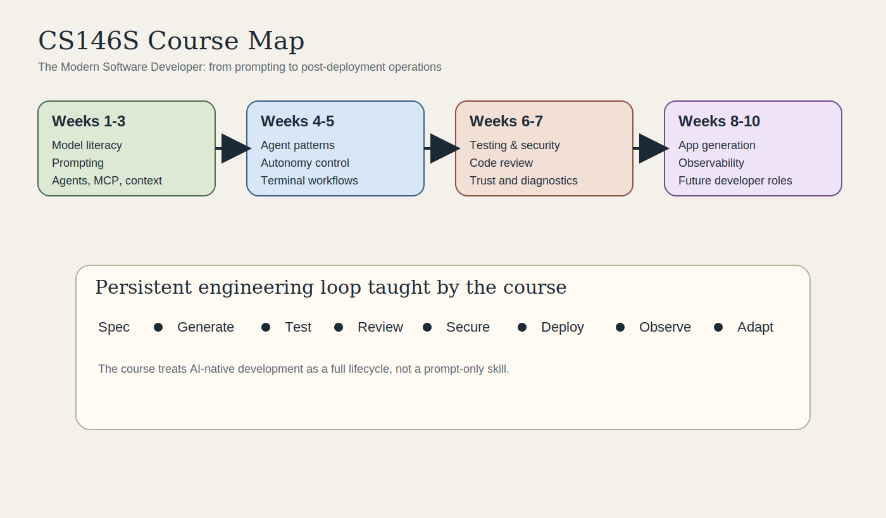
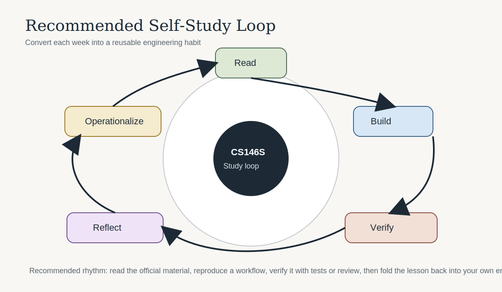
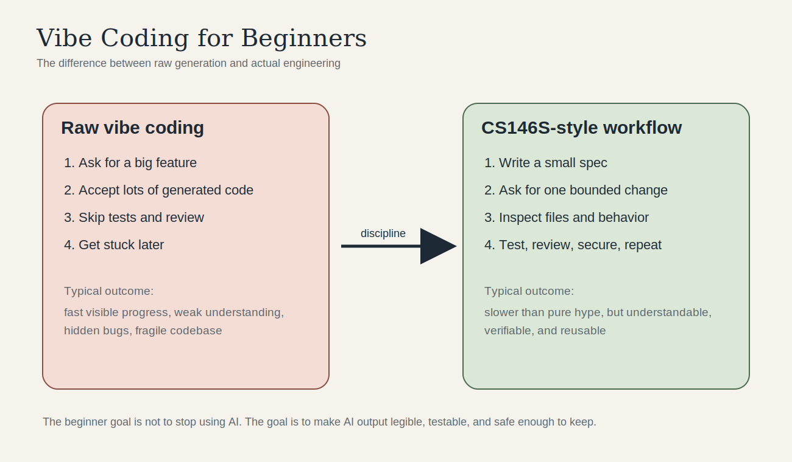

# CS146S Study Project

Systematic study notes for **CS146S: The Modern Software Developer** at Stanford University.

This internal project tracks the course structure, weekly themes, assignment patterns, and a practical self-study path based on the public course website and assignment repository.

## Scope

- Reconstruct the public course structure from official materials
- Summarize the core engineering themes behind the course
- Convert the syllabus into an actionable self-study plan
- Capture assignment patterns that can be reused inside this repository

## Official Sources

- Course site: [CS146S: The Modern Software Developer](https://themodernsoftware.dev/)
- Public assignments repo: [mihail911/modern-software-dev-assignments](https://github.com/mihail911/modern-software-dev-assignments)

See [sources.md](./sources.md) for the curated source list used in these notes.

## Recommended Reading Order

If this is your first time learning AI-assisted software development, read in this order:

1. [00a-vibe-coding-primer.md](./notes/00a-vibe-coding-primer.md)
2. [05-glossary.md](./notes/05-glossary.md)
3. [00-course-overview.md](./notes/00-course-overview.md)
4. [01-weekly-map.md](./notes/01-weekly-map.md)
5. [02-core-principles.md](./notes/02-core-principles.md)
6. [03-assignment-patterns.md](./notes/03-assignment-patterns.md)
7. [04-study-plan.md](./notes/04-study-plan.md)

## Notes

- [00a-vibe-coding-primer.md](./notes/00a-vibe-coding-primer.md)
- [05-glossary.md](./notes/05-glossary.md)
- [00-course-overview.md](./notes/00-course-overview.md)
- [01-weekly-map.md](./notes/01-weekly-map.md)
- [02-core-principles.md](./notes/02-core-principles.md)
- [03-assignment-patterns.md](./notes/03-assignment-patterns.md)
- [04-study-plan.md](./notes/04-study-plan.md)

## Visuals

## Key Takeaway

CS146S is not a generic "use AI tools" course. It is a software engineering course that reframes the modern developer around five operating capabilities:

1. Prompt and model literacy
2. Agent and tool orchestration
3. Context and specification management
4. Testing, security, and review discipline
5. Post-deployment operations and observability
